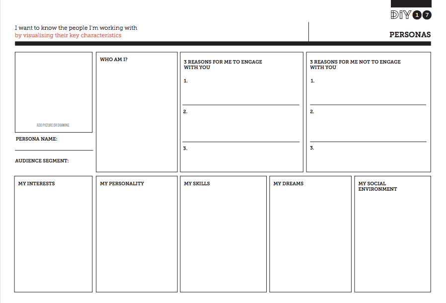
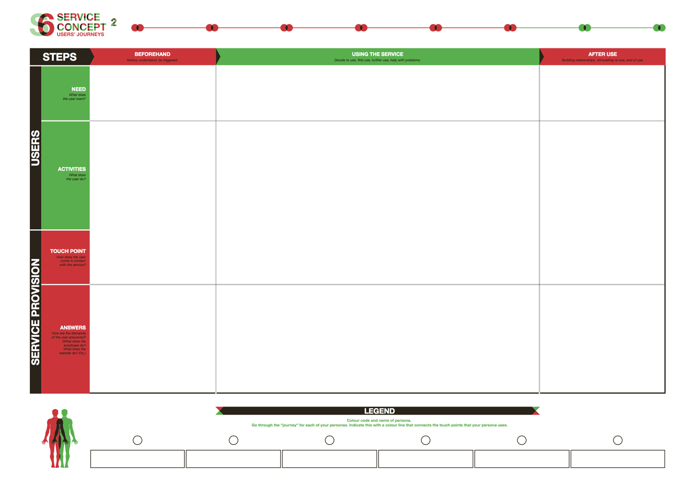

### 一、使用ORID方法结构化对话
我们都知道这种情况：你被叫去开会，现在你坐在那里，越来越无聊，因为讨论到处游荡，变得偏离轨道，被嘈杂和冗长的东西所支配。当做出决定时，你会发现没有人准备好，因为任性的讨论混淆，误导和混淆了问题，而且信息太少了。听起来很熟悉？我们都参加过像这样的没有重点，浪费时间的会议。但是-它不一定是这样的。
```
ORID（客观，反思，解释，决策）方法是一种由协调人领导的结构化对话形式。
```
该方法由文化事务研究所开发，作为分析事实和感受，询问影响和明智地做出决定的手段。这是一种逃避疯狂会议泥潭的手段。

当由具有一定使用该方法经验的协调人完成时，参与者通常不知道他们正在参与结构化的对话。就好像有人和小组坐下来，开始了非正式的讨论。
ORID本质上是一种决策工具，可用于：

1. 可持续发展教育者，让观众参与审议或回顾前一次会议或课程中涵盖的内容
2. 社区组织，企业，政府以及几乎任何寻求决策的团体
由教育工作者在课堂上探索决策
3. 在一对一的对话中，为个人澄清行动路径;这为ORID在个人问题解决，咨询和社区工作中发挥了潜在作用。
4. 记者，他们可能会使用ORID来组织深入和调查性的采访，尽管更传统的记者可能会将其视为深入研究解决问题，而不是传统的事实和反应报道。
[详细说明](#ORID结构化流程)

### 二、使用看板
看板是由丰田工业工程师大野太一开发的生产调度控制工具，用于控制供应链以提高生产效率。如今，看板已成为管理项目的有效工具，特别是对于具有产出和目标的项目。Trello是用于项目管理的看板的在线版本。


### 三、使用微信群和腾讯文档进行头脑风暴


### 四、使用OKR反馈结果
目标和关键结果（OKR）是目标管理的有效系统，用于在组织中设定和传达目标和结果。OKR的主要目标是将公司，团队或个人目标与可衡量的结果相结合，以便工作能够朝着正确的方向发展。目前，PDIS团队使用话语作为OKR的后端。


### 五、用户画像
人物角色是描述特定主题组的虚构现实的个人形象。通过将这个角色和类似人的行为、行动和偏好绘制成“个人角色”，你可以理解这个角色的群体。角色的性格以建立角色的方式显示，角色的性格不会丢失。 此类角色扮演有助于确保工作始终以用户为中心，而不是对用户各自组的抽象描述。


### 六、用户心路历程
用户旅程是显示人们如何逐步与服务交互的过程。通过用户体验之旅，工作团队可以识别服务过程中的问题点，以确认新想法的哪些部分可以改进。


### 七、VRChat...

---

#### ORID结构化流程
使用ORID的会议与我们习以为常的漫无边际，不集中的结构相反。ORID创造了一个动态的前进运动，朝着一个决策点前进。

以下是使用它的方法...

首先，会议同意使用ORID并遵守该过程。它任命一名具有使用该方法经验的协调人。会议同意，当参与者将讨论浪费在一边时，主持人可以将会议恢复为有序。

主持人带领小组通过一系列问题，这些问题导致决策阶段。对于每个问题，抄写员都会在黑板上写下要点。

战略问题
O — 客观问题
O问题确定了与主题相关的客观事实。关键问题是：我们对此了解多少？

如果这是ORID的主题或事件，则小组会回忆起该事件并从中提炼出事实。

协调人必须保持警惕，让人们在这个阶段（接下来）讨论他们对这个话题的看法和他们对它的感受。我们现在想要的只是事实。当心以“我认为...“，'我觉得...“这是我的意见...'.

我们想要的是以“我看到了......“，”我听说...“，'我知道...“，”有证据表明...'， '记录在案的是...'.这些都有文件记录，但没有分析。

R — 反思性问题
R问题是关于人们对这个话题的看法。它们是关于主观感知的。关键问题是：我们对此有何感想？

感觉可能是积极的或忧虑的，可能是情绪化的。

R问题允许参与者表达他们的直觉，尽管这些可能没有客观事实来支持他们。尽管如此，它们是对有关专题进行全面评估的一部分，不应被忽视。在这个阶段，恐惧和担忧可能会浮出水面。

这个阶段是识别感觉而不是分析它们。

I — 解释性问题
这些问题与意义有关。解释阶段的关键问题是：这对我/你/组织等意味着什么？

基于在客观和反思性提问期间获得的信息进行讨论，讨论可以透视该主题，并探索该主题对个人或组织的潜在影响。

解释性问题可能包括“如果......怎么办？”问题以及“这意味着什么......”，“那会做什么......”等等。

这是分析阶段。

D — 决策问题
根据来自前三个提问阶段的信息，这是做出决定的阶段。决策阶段的关键问题是：我们要做什么？

主持人可以通过回顾前三个阶段的调查结果，为这一关键问题设定场景。

决策阶段的讨论重点在于未来。最好的行动方案是什么？什么是可以实现的积极成果？鉴于我们资源有限，什么是现实的？

一些需求
在所有四位圣贤中，主持人的问题和发言的措辞对于保持重点突出的讨论至关重要。

为ORID过程留出足够的不间断时间非常重要。匆忙的对话和频繁的打断会切断重要的讨论，并分散注意力。运行 ORID 进程没有固定的时间。如果有足够的时间充分涵盖所有问题，则可以使其相对较短。

建议计划使用ORID技术的主持人和教育工作者在进入重要的决策过程之前与他们认识的人一起练习。


