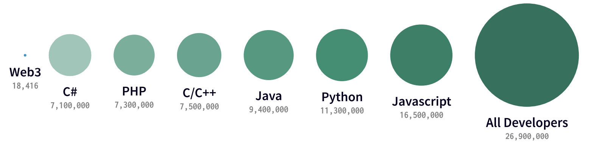

### 技术负债
第一次发布代码，就好比借了一笔钱。只要通过不断重写来偿还债务，小额负债可以加速开发。但久未偿还债务会引发危险。复用马马虎虎的代码，类似于负债的利息。整个部门有可能因为松散的实现，不完全的面向对象的设计或其他诸如此类的负债而陷入窘境。技术债务的四个象限如下

| Not Available  | 鲁莽 | 谨慎 |
| ------------- | ------------- | ------------- |
| 故意   | 我们没有时间做设计  | 我们必须马上交付，后果以后说  |
| 疏忽  | 什么是分层设计  | 现在我们才知道该如何做了  |


常见的技术债务的原因有：

1. 不充足的事前定义，从而需求仍然在开发过程中被定义，开发在设计之前就已经开始。这种做法的目的是节约时间，但常不得不以后返工。
2. 商务压力。商务角度需要在必须的改变完成之前就发布产品。因此开发的技术债务包括那些待完成的改变。
3. 缺少流程或理解，从而商务上对技术债务不了解，不考虑后果就做出决策。
4. 紧耦合组件。功能不是模块化，软件不够灵活应对商务上的变化。
5. 缺乏测试包。这刺激了快速高风险“凑活式”的修复bug。
6. 缺少文档。写代码但没有必要的支撑性文档。
7. 缺乏合作。知识没有得到共享，对新手缺乏监督辅导。
8. 在两个或多个分支上平行开发而累积了技术债务。由于工作最终需要合并两个分支的代码，拖延越晚，需要工作代价越大。
9. 拖延做重构 – 重构拖延越晚，需要修改的代码越多。
10. 缺少与标准对齐。工业标准的特性、框架、技术被忽视。最终也必将遵从标准，做得越早代价越小。
11. 缺少知识。开发者并不知道如何写精致的代码。
12. 缺少所有权。外包的软件最终要让自己的工程师去重构或重写源代码。
13. 技术领导力差，未深思熟虑的命令通过命令链传达下来，增加了技术债务，而不是减少它。
14. 最后一分钟规范改变。这有可能渗透到整个项目中，没有时间或预算通过文档或检查来发现它们。

```
道路千万条，安全第一条，以时间空间成本风险为安全导向，始终坚持第一性原理(原料工具生产数据)、跨领域、边做边学、MVP
```



#### 轻型工具 js
* design figma blender
* data pipcook(nodejs) 
* mobile html
* server deno
* hardware toit
* contract endojs
* database pouchdb excel
* money stripe
* desktop electron


#### 中型工具 py
* design sketch
* data python
* mobile uniapp
* server  go
* hardware m5stack
* contract solidity
* database pgsql
* desktop pyside2

#### 重型工具 java
* design ps
* data scala
* mobile flutter
* server java(spring)
* hardware c
* contract rust
* database big-data-stack
* desktop c#/swift/cpp

